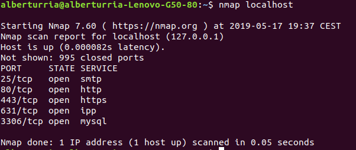

# Ejercicio 2

## Enunciado

Comprobar qué puertos tienen abiertos nuestras máquinas, su estado, y qué programa o demonio lo ocupa.

## Solución

Para resolver esta cuestión hemos ejecutado el comando `nmap localhost`.

